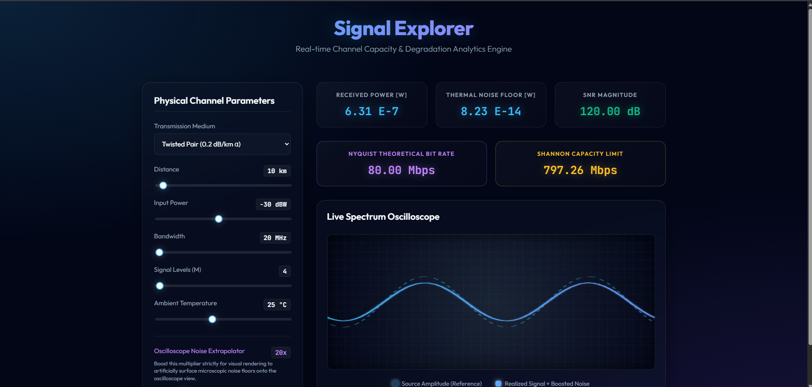

# Data Communications Simulator



A full-stack application that simulates physical data transmission channels. It calculates signal attenuation, thermal noise levels, Signal-to-Noise Ratio (SNR), Nyquist theoretical bit rates, and Shannon Capacity limits in real-time.

This project uses a highly performant **C binary** for the mathematical physics engine, a **Node.js Express** backend API to pipe data, and a stunning **Vite React** frontend with an animated oscilloscope.

---

## Architecture Overview

1. **C Core Engine (`core/`)**
   - The math engine written in standard C. 
   - `sim.exe` acts as a fast CLI program. It intakes physical inputs (Distance, Bandwidth, Medium, etc.) via arguments, performs attenuation/noise calculations based on Bolton's constant, and outputs results in JSON format.
2. **Node.js API (`backend/`)**
   - An Express.js REST API running on port `3000`.
   - It listens for simulation requests on `/simulate`, spawns a child process to execute the `sim.exe` binary, and returns the JSON payload to the web client.
3. **React Web UI (`ui/`)**
   - A modern, glassmorphic dashboard built with Vite and React.
   - It debounces slider inputs, sends HTTP requests to the backend, and visualizes the degraded signal in real-time versus a clean reference signal using an animated SVG Oscilloscope.

---

## Getting Started

To run the full stack locally, you need two terminal windows: one for the backend API and one for the frontend UI.

### 1. Compile the C Engine
If you make changes to `core/*.c`, you must recompile the math engine for the backend to use:
```cmd
gcc core/*.c -o sim -lm
```

### 2. Start the Backend API
The Express backend executes your C simulation and serves the data.
```cmd
cd backend
npm install
node server.js
```
*The API will start running on `http://localhost:3000`.*

### 3. Start the Frontend UI
The React dashboard serves the interactive simulation controls.
```cmd
cd ui
npm install
npm run dev
```
*Open your browser to `http://localhost:5173/` to view the UI.*

---

## UI Features

- **Interactive Telemetry:** Slide parameters like distance, temperature, input power, bandwidth, and signal levels to dynamically stress-test the simulation.
- **Physical Medium Selection:** Toggle between *Twisted Pair* ($0.2 \text{ dB/km}$) and *Fiber Optic* ($0.05 \text{ dB/km}$) attenuation profiles.
- **Oscilloscope Noise Extrapolator:** Due to naturally minuscule thermal noise amplitudes, we've provided a visual slider to artificially amplify the noise jitter on the SVG oscilloscope so you can visually study signal degradation mechanics at varying SNRs.

## Physics Equations Standardized
* **Attenuation ($P_{RX}$)**: $P_0 \cdot 10^{-(\alpha \cdot d) / 10}$
* **Thermal Noise ($N$)**: $k \cdot T \cdot B$
* **Nyquist Bit Rate**: $2 \cdot B \cdot \log_2(M)$
* **Shannon Capacity**: $B \cdot \log_2(1 + \text{SNR})$
